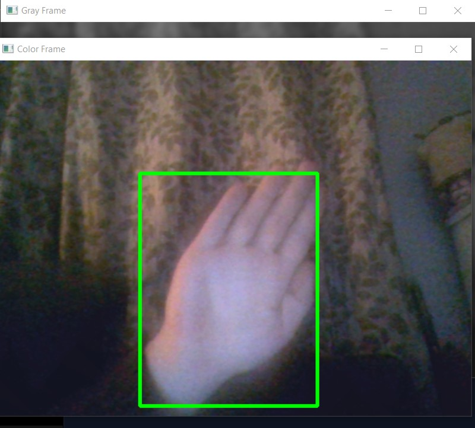

# 🎥 Webcam Motion Detector

Monitor motion in real-time with a **live adjustable sensitivity slider**!  
Perfect for detecting movement, logging motion times, or just experimenting with computer vision.  

This project was just me messing around and experimenting with Python and OpenCV.  

---

## 🚀 Features

- Real-time motion detection using your webcam  
- Live **threshold slider** to adjust sensitivity on the fly  
- Records start and end times of detected motion  
- Saves motion logs to a CSV file for analysis  
- Visual feedback with multiple display windows:
  - Grayscale frame
  - Threshold frame
  - Color frame with motion rectangles  

---

## 🧭 How It Works

1. Converts webcam frames to **grayscale** and applies **Gaussian blur**.  
2. Compares each frame to a **static background**, updating it gradually to handle lighting changes.  
3. Highlights motion using **contours** and draws **green rectangles** around detected areas.  
4. Tracks motion events and logs **start/end times** in `Time_of_movements.csv`.  
5. Adjust the **threshold slider** to make the detector more or less sensitive depending on your environment.  

---

## 🖼️ Screenshots

<p align="center">
  
  &nbsp;&nbsp;&nbsp;&nbsp;
  
</p>


---

## 🧩 Usage Guide

1. Run the Python script:
   ```bash
   python motion_detector.py
   Press q to quit program 
   sweet spot on my webcam was around 15-25 treshold

Feel free to edit or expand on this as you see fit.
